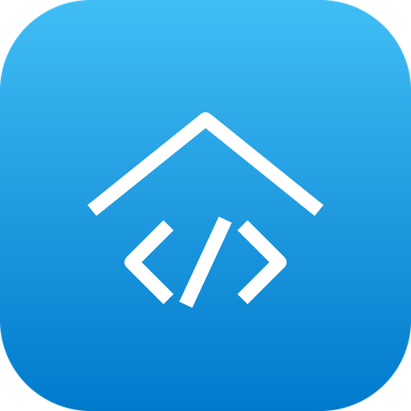

# Zipponia Home Assistant Add-ons

<p align="center">
  
  
  
</p>

Custom add-ons for **Home Assistant OS**.

## Installation

Add this repository to Home Assistant:

[](https://my.home-assistant.io/redirect/supervisor_add_addon_repository/?repository_url=https%3A%2F%2Fgithub.com%2FZipponia%2FHassOS_Addons)

Or manually: **Settings → Add-ons → Add-on Store → ⋮ → Repositories**, then paste

```
https://github.com/Zipponia/HassOS_Addons
```

The add-ons below then appear in the store.

## Add-ons

### [VS Code Remote SSH (Debian)](VSCode_Remote)



A glibc-based SSH server so the VS Code desktop app can attach with **Remote-SSH**
and edit your Home Assistant configuration with the full editor. Uses a Debian
base image, avoiding the musl/`gcompat`/`fcntl64` problem that breaks Remote-SSH
on the Alpine-based SSH add-ons.

Persists the VS Code Server, SSH host keys and the Claude Code home across
restarts and rebuilds. Optionally grants full-system and Docker access.

<br clear="left">

📖 [Documentation](VSCode_Remote/DOCS.md) · 📝 [Changelog](VSCode_Remote/CHANGELOG.md)

## Repository layout

```
.
├── repository.yaml        # add-on repository metadata
├── LICENSE
└── VSCode_Remote/         # one folder per add-on
    ├── config.yaml
    ├── build.yaml
    ├── Dockerfile
    ├── run.sh
    ├── icon.png
    ├── logo.png
    ├── DOCS.md
    └── CHANGELOG.md
```

These are **local-build** add-ons: they have no `image:` field, so Home Assistant
builds them on your machine. An update appears only when the `version` field in
`config.yaml` is bumped; refresh with **Add-on Store → ⋮ → Check for updates**.

## License

MIT — see [LICENSE](LICENSE).
