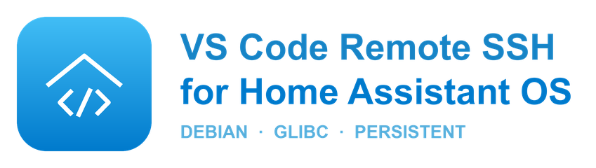

<p align="center">
  
</p>

<p align="center">
  
  
  
  
</p>

A glibc-based SSH server so the **VS Code desktop app** can attach to Home
Assistant OS with **Remote-SSH** and edit your configuration with the full
editor — extensions, IntelliSense, integrated terminal and source control.

The VS Code Server ships a bundled Node binary linked against **glibc**. The
Alpine-based SSH add-ons use **musl**, so Remote-SSH breaks on recent VS Code
versions (`gcompat` / `fcntl64` errors). This add-on uses a Debian base image,
where that binary runs natively.

## Features

- 🔌 **Remote-SSH that works** — Debian/glibc base, no musl workarounds.
- 📂 **Config at your fingertips** — `/homeassistant` and every mapped folder
  symlinked into `/root`, visible the moment you connect.
- 💾 **Nothing is lost on restart** — VS Code Server, SSH host keys and the
  Claude Code home (`~/.claude`, `~/.claude.json`) persist on `/data`.
- 🧹 **No disk creep** — old VS Code Server builds are pruned automatically.
- 🔑 **Key-only auth** — password login is disabled.
- 🐳 **Full-system access** (optional) — with Protection mode off, manage Home
  Assistant, the Supervisor and every Docker container from the terminal.

## Installation

Add the repository, then install the add-on:

```
https://github.com/Zipponia/HassOS_Addons
```

**Settings → Add-ons → Add-on Store → ⋮ → Repositories**

## Quick start

```yaml
authorized_keys:
  - "ssh-ed25519 AAAAC3Nz... you@your-mac"
```

Start the add-on, then connect:

```
ssh -p 22 root@<home-assistant-ip>
```

In VS Code: **Remote-SSH: Connect to Host…**, then open `/homeassistant`.

📖 Full documentation, options and troubleshooting: **[DOCS.md](DOCS.md)**
📝 Version history: **[CHANGELOG.md](CHANGELOG.md)**

## License

MIT — see [LICENSE](../LICENSE).
